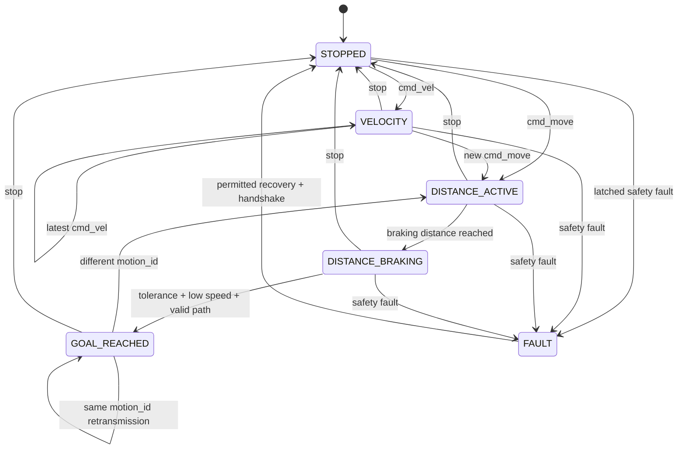

# ESP32 Low-Level Motion Controller Redesign

## Status and scope

This design replaces the current monolithic ESP32 firmware with a new low-level
motion controller. The existing firmware is reference material only. The wheel
speed PID calculation, gains, state arrays, and anti-windup concept remain the
one preserved implementation core.

The redesign covers motor and encoder I/O, typed UDP commands, legacy command
migration, latest-wins command delivery, watchdogs, motion states, distance
control, acceleration and braking, odometry, telemetry, manual tests, faults,
configuration, secrets, tests, and documentation.

Software compilation and unit tests establish `SOFTWARE_VERIFIED`. Physical
wiring, encoder polarity, counts per wheel revolution, motor polarity, motion
accuracy, and tuning remain outside that claim until robot tests establish
`HARDWARE_VERIFIED`.

## Hardware source of truth

The pin map follows GitHub `jugonpark/smart_coaster_09` main commit `06693c1`.
It supersedes the conflicting candidate M3 mapping in the original request.

| Device | IN1 | IN2 | PWM | ENC_A | ENC_B |
|---|---:|---:|---:|---:|---:|
| M1 | 19 | 18 | 25 | 34 | 35 |
| M2 | 21 | 22 | 26 | 16 | 17 |
| M3 | 23 | 13 | 14 | 32 | 33 |
| TB6612 STBY | 27 | | | | |

`robot_config.h` is the only pin-map definition. `motorReversed[3]` and
`encoderReversed[3]` remain independent calibration settings. The required
logical invariant is: positive target, physical positive wheel motion, and
positive measured wheel speed agree.

M1 GPIO34/35 have no internal pull-ups. Their external pull-up wiring must be
verified before motor testing. Every encoder setting carries the source comment
`VERIFY WITH PHYSICAL WIRING BEFORE MOTOR TEST`.

## Coordinate convention and units

Robot frame:

```text
          +X forward
              ^
              |
 +Y left <----+    positive w is CCW
```

Wheel order is M1/M2/M3 at 0/120/240 degrees. Internal distance is centimeters,
linear and wheel velocity are cm/s, angular velocity is rad/s, angle is radians,
encoder position is counts, control time is seconds, and scheduling/watchdog
time is unsigned milliseconds or microseconds with explicit names.

Inverse and forward kinematics use this same frame and wheel order. Host tests
cover zero motion, pure X, pure Y, pure rotation, and IK-to-FK round trips.

## File architecture

The Arduino sketch remains a thin composition root. Modules are function and
fixed-structure based, without a class hierarchy.

```text
esp32_omni_controller.ino      setup, cooperative scheduler, module wiring
robot_config.h                 pins, units, geometry, limits, timing, PID/FF
motor_encoder.h/.cpp           safe motor output, ISR, count and speed sampling
kinematics_motion.h/.cpp       IK/FK, limiters, odometry, goals and braking
network_protocol.h/.cpp        typed decode, legacy adapter, acceptance/mailbox
safety_telemetry.h/.cpp        watchdog, faults, recovery, telemetry JSON
odometry_math.h                hardware-independent constexpr math
secrets.example.h              repository-safe Wi-Fi template
```

The local untracked `secrets.h` supplies credentials. It is excluded through
`.gitignore`; source and documentation never print or commit the password.

## Runtime data flow and scheduling

```text
UDP or Serial input
  -> bounded decode
  -> NormalizedCommand
  -> session/sequence/type/value/limit acceptance
     -> STOP or FAULT: immediateStopNow()
     -> heartbeat: refresh watchdog only
     -> motion: latest-wins mailbox
  -> 100 Hz control tick
     -> encoder sample and validation
     -> safety and motion state
     -> acceleration or braking limit
     -> inverse kinematics and wheel normalization
     -> preserved wheel PID core
     -> motor output
  -> 5 Hz telemetry snapshot
```

The encoder ISR reads direction and changes one volatile count only. It performs
no floating-point work, JSON, or Serial output.

The main loop checks a due control tick before and after UDP service. Each UDP
service call handles at most four datagrams and at most 1,000 microseconds.
Packets are capped at 512 bytes. Remaining datagrams stay in the socket for the
next loop. Telemetry serialization and Wi-Fi reconnect work never run inside a
control tick.

Control period is 10 ms. The scheduler records overruns, validates measured dt,
and clamps the PID dt to configured minimum and maximum values rather than
passing an unbounded delayed interval to the controller.

## Command model and latest-wins mailbox

All decoded input becomes one fixed `NormalizedCommand` representation:

```cpp
enum class CommandType { VELOCITY, MOVE, STOP, HEARTBEAT, RESET_FAULT };

struct NormalizedCommand {
    CommandType type;
    uint32_t sessionId;
    uint32_t seq;
    CommandStatus status;
    float vxCmS;
    float vyCmS;
    float wRadS;
    int32_t motionId;
    float targetDistanceCm;
    uint32_t receivedAtMs;
};
```

There is no FIFO. A single motion mailbox holds the most recent accepted
velocity request or new distance request, with a monotonically increasing local
revision. Heartbeats never occupy the mailbox. If multiple motion packets arrive
between ticks, only the highest accepted revision executes.

Velocity semantics are ephemeral: a newer accepted `cmd_vel` replaces the old
desired body velocity. Distance semantics are persistent: the accepted goal is
owned by the motion state until completion, cancellation, fault, STOP, or a
different accepted motion request.

STOP, watchdog expiry, Wi-Fi loss in NETWORK mode, and every safety fault bypass
the mailbox and every acceleration limiter. `immediateStopNow()` sets all PWM and
targets to zero, resets PID state, clears pending motion, and enters STOPPED or
FAULT before any later service executes.

## Typed UDP protocol

Typed packets use the existing command port 8888 and telemetry port 8889.
Absolute sender timestamps are not used for freshness.

Velocity:

```json
{"type":"cmd_vel","session_id":38192014,"seq":101,
 "status":"RUN","vx":10.0,"vy":0.0,"w":0.0}
```

Distance:

```json
{"type":"cmd_move","session_id":38192014,"seq":102,
 "motion_id":20,"status":"RUN","vx":10.0,"vy":0.0,"w":0.0,
 "target_distance_cm":30.0}
```

Stop and heartbeat:

```json
{"type":"stop","session_id":38192014,"seq":103}
{"type":"heartbeat","session_id":38192014,"seq":104}
```

Fault reset is explicit and valid only while stopped:

```json
{"type":"reset_fault","session_id":38192014,"seq":105}
```

Each controller process generates a nonzero random `session_id`. Within one
session, only increasing sequence numbers are accepted. Duplicate and stale
packets are ignored after complete decode and validation and do not stop motion.
A new session while moving triggers immediate STOP and requires a valid STOP or
heartbeat handshake before its first motion command can execute.

Malformed JSON, non-finite values, invalid types, and absolute safety-limit
violations cause immediate STOP and the relevant fault.

## Legacy migration adapter

`ENABLE_LEGACY_PROTOCOL` defaults to true during migration. A legacy packet
`{seq,t,vx,vy,w,status}` is decoded only by the adapter and converted to the same
`NormalizedCommand`; it has no separate motor path. `t` is ignored.

A reserved legacy session ID is used. Sequence reset is accepted only while the
robot is stopped after a valid STOP synchronization phase or watchdog expiry.
Legacy packets with both `motion_id` and `target_distance_cm` become MOVE;
packets without both become VELOCITY; STOP becomes STOP. Partially supplied
distance fields are invalid.

New host components send typed packets. Existing telemetry aliases remain during
migration so older GUI and Raspberry Pi receivers can observe the controller.

## Motion and goal states



The states are STOPPED, VELOCITY, DISTANCE_ACTIVE, DISTANCE_BRAKING,
GOAL_REACHED, and FAULT. Extra flags do not duplicate state.

For a distance command, a new motion ID starts one goal. Repetition of the same
ID with identical direction and distance refreshes controller liveness without
resetting origin or progress. Repetition with changed content is a protocol
fault and immediate STOP. A completed ID stays reached. A different valid ID is
a new request.

## Limits, acceleration, feed-forward, and PID

Initial configurable limits are 15 cm/s body linear speed, 20 cm/s wheel speed,
and 1.0 rad/s angular speed. SLOW uses 5 cm/s linear speed. Absolute hard limits
are separately defined and violations fault rather than clamp.

Accepted commands pass body speed limits, IK, wheel normalization, and slew-rate
limits before reaching PID. Linear, angular, and wheel acceleration/deceleration
limits are explicit configuration values. Direction reversal therefore ramps
through zero in ordinary motion. STOP and FAULT remain immediate.

Feed-forward is optional through `ENABLE_FEED_FORWARD`. The existing measured
positive and negative per-wheel LUT may be retained within its calibration range.
Targets outside that range are prevented by configured operating limits rather
than silently using the final LUT value.

Minimum drive compensation is optional and per wheel/direction. Zero target
always produces zero PWM. Nonzero target may apply the configured minimum only
after combined PID/feed-forward output is nonzero and below the effective
deadzone.

The preserved PID core keeps `PID_KP`, `PID_KI`, `PID_KD`, `pidIntegral[]`,
`pidPreviousError[]`, `measuredWheelSpeed[]`, `targetWheelSpeed[]`, the current
P/I/D calculation order, output saturation, and anti-windup concept. No library
replacement or gain tuning is part of this redesign.

## Encoder validation and odometry

Counting remains A-phase RISING with B-phase direction, so the configured counts
per wheel revolution is an x1 value. The initial value is documented as measured
at the output wheel shaft, approximately 895-900 counts/rev, and must be verified
per hardware configuration.

Theoretical maximum count delta per control tick is derived from wheel limit,
wheel circumference, counts/rev, and control dt. A configurable safety margin of
3 multiplies that result. No fixed threshold of 2000 remains.

Each valid tick converts count deltas to wheel displacement, applies FK, and
integrates local `dx`, `dy`, and `dtheta` using midpoint heading. Goal progress is
the displacement projection onto the saved goal unit vector. Lateral error is
the perpendicular projection.

## Distance braking and completion

Allowed translation speed follows a braking-distance bound:

```text
v_allowed = sqrt(2 * configured_deceleration * max(remaining, 0))
```

It is capped by requested cruise speed and the state enters DISTANCE_BRAKING when
the braking bound becomes active. A small configurable approach speed may be used
outside final tolerance, but never overrides STOP or a fault.

Goal completion requires all of the following:

- absolute remaining distance within tolerance;
- measured active-wheel speed below the completion threshold;
- lateral error within the allowed threshold;
- valid encoder and odometry state.

Overshoot does not reverse the motors. It immediately stops and records positive
`overshoot_cm`. Excess lateral deviation enters `FAULT_PATH_DEVIATION`; it cannot
be reported as success.

## Faults and recovery

Faults are explicit values: NONE, WIFI_LOSS, CMD_TIMEOUT, BAD_PACKET,
SPEED_LIMIT, ENCODER_JUMP, ENCODER_INVALID, ODOMETRY_INVALID, PATH_DEVIATION,
and CONTROL_TIMING.

Every fault immediately stops motors, zeros targets, resets PID, clears pending
motion, and records the cause. WIFI_LOSS, CMD_TIMEOUT, and BAD_PACKET are
recoverable after the condition clears and a fresh session STOP/heartbeat
handshake is complete. Encoder, odometry, path, speed, and timing faults require
an explicit `reset_fault` while stopped and a subsequent handshake.

NETWORK mode stops on Wi-Fi loss. MANUAL_TEST mode is independent of Wi-Fi and
has a 3,000 ms command timeout. Serial STOP always works.

## Motor driver boot safety

Setup order is Serial, motor safe output, STBY LOW, GPIO setup, encoder setup,
interrupt attachment, PWM attachment, PWM zero, control reset, Wi-Fi start, UDP
start when connected, STBY HIGH, and boot diagnostics. No movement is possible
without a fresh accepted command.

Direction changes write PWM zero, wait a short configured deadtime, set direction
pins, and apply duty. Arduino-ESP32 Core 3.x `ledcAttach` and `ledcWrite` APIs are
used.

## Manual test interface

Serial commands are HELP, STATUS, PIN, ENC, ZERO, AUTO, MANUAL, STOP, M1/M2/M3,
ALL, VEL, and MOVE. Manual motor commands refresh the 3-second manual watchdog.
VEL and MOVE reuse the same normalized acceptance and motion path after entering
MANUAL_TEST, rather than owning alternate control algorithms.

No 100 Hz diagnostic printing is allowed. Periodic status uses a slow configured
interval; detailed output is command-driven.

## Telemetry

Telemetry is sent at 5 Hz to the accepted controller address and contains:

- `type`, `boot_id`, `session_id`, `last_seq`, `uptime_ms`;
- `mode`, `state`, `fault`;
- `cmd_vx`, `cmd_vy`, `cmd_w`, `command_age_ms`;
- `wheel_target`, `wheel_speed`, `wheel_pwm`, `encoder_count`;
- `motion_id`, `goal_target_cm`, `goal_progress_cm`, `remaining_cm`;
- `lateral_error_cm`, `overshoot_cm`;
- `odom_dx_cm`, `odom_dy_cm`, `odom_dtheta_rad`;
- `wifi_rssi`, `control_overruns`.

During migration, aliases `seq`, `status`, `counts`, `rpm`, `target_speed`,
`pwm`, and the existing optional goal fields remain. Missing or inapplicable goal
values are null or omitted, not fabricated as successful zero values.

## Host migration

The Windows controller, UDP test tool, Raspberry Pi sender, and Raspberry Pi
telemetry receiver move to typed commands and generate a session ID per process.
Their safety behavior remains fail closed. Tests cover typed output and the
temporary legacy compatibility path.

## Verification

Host-side tests cover:

1. zero, pure X, pure Y, and pure rotation kinematics;
2. IK-to-FK round trip;
3. progress and lateral projection;
4. theoretical encoder jump threshold;
5. speed normalization and body/wheel slew limits;
6. braking profile and no reverse overshoot correction;
7. latest-wins mailbox replacement;
8. duplicate/stale sequence ignore after decode;
9. session restart STOP/handshake;
10. new, repeated, changed, and completed motion IDs;
11. watchdog in velocity and distance modes;
12. goal completion gates, overshoot, and lateral fault;
13. manual timeout and Wi-Fi-independent manual mode;
14. legacy adapter normalization;
15. immediate STOP/FAULT bypass;
16. telemetry parsing and compatibility aliases.

The delivery gate is all Python regression tests, native math tests/static
assertions, Arduino ESP32 compilation, Python syntax checks, and `git diff
--check`. These prove software behavior only.

## Physical verification sequence

With wheels raised, verify M1, M2, and M3 forward/reverse independently, then
confirm matching encoder sign. Test 10 cm/s per wheel, all wheels together,
robot +X, robot +Y, rotation, 15 cm goal, and 30 cm goal. Record count/rev,
physical distance, lateral drift, heading drift, overshoot, PWM, target, and
measured speed before changing calibration values or claiming hardware verified.
